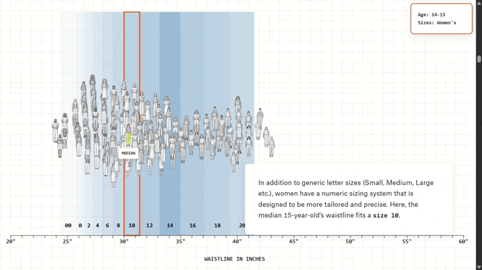

# Analizando "Fit 4 a teen"
Bajo la autoría de Amanda Sakuma y Jan Diehm, este reportaje desmantela el mito del tallaje 'universal' en la industria de la moda. La pieza empieza con un relato personal en un probador que sirve como un gancho empático para introducir una cruda realidad estadística: a partir de los 15 años, el sistema de tallas deja de responder a la evolución biológica de las mujeres. 

A través del análisis de datos sobre medidas promedio de cintura, la investigación evidencia la desconexión crítica entre los cuerpos reales y una industria que se niega a cambiar con ellos.

Ver ["Fit 4 a teen"](https://pudding.cool/2026/02/womens-sizing/)

<h2 align="center">Estructura narrativa</h2>

Lo que resulta particularmente distintivo de esta webstory es la integración de las vivencias personales de la autora. Este recurso no solo humaniza las cifras, sino que le da al relato una resonancia y un impacto mucho mayor.

Y aunque este conflicto pueda verse como una cuestión menor frente a otras problemáticas globales, representa una experiencia de incomodidad sistémica compartida por todas aquellas mujeres que no encajamos en el estándar rígido que promueve la industria de la moda.

La estructura narrativa permite visibilizar con claridad cómo, a pesar de las transformaciones biológicas naturales que ocurren entre la adolescencia y la adultez, el tallaje industrial —específicamente en los pantalones— no se ajusta de manera proporcional a los cambios que experimenta el promedio de la población.

El reportaje no se limita a la crítica, sino que además hace una propuesta que invita a la autonomía: el aprendizaje de la costura y el patronaje desde cero. Al mostrar el proceso técnico de crear un bodice block (patrón base) basado en sus proporciones únicas, la autora despoja al sistema industrial de su autoridad, devolviendo la agencia al individuo.

Esto es fundamental, ya que permite al lector comprender que la solución no es intentar 'arreglar' su cuerpo para que encaje en un molde genérico, sino reclamar su autoridad sobre la propia vestimenta.

  

La implementación de una interfaz basada en el scrollytelling es también uno de los mayores aciertos de este proyecto. Este sistema permite una navegación fluida y lineal que evita que el usuario se sienta abrumado por una cantidad excesiva de botones o puntos de interacción dispersos. La narrativa guía la mirada: las estadísticas y visualizaciones se transforman dinámicamente para ilustrar puntos específicos del relato, eliminando la carga de que el lector deba interpretar datos aislados por su cuenta. En este sentido, el diseño actúa como un editor invisible que contextualiza cada cifra.

Sin embargo, la experiencia de usuario presenta desafíos técnicos de adaptabilidad. El reportaje parece estar optimizado exclusivamente para una visualización a pantalla completa en monitores de dimensiones específicas; esto provoca que, en ventanas de navegación más pequeñas o con zoom, ciertos elementos visuales críticos se vean interrumpidos o 'cortados' por los bordes del navegador.

A esto se suma un problema de jerarquía visual y superposición: al mantener los bloques de texto anclados a un costado de la pantalla, estos suelen solaparse con las gráficas del fondo. Esta colisión de capas no solo dificulta la lectura del texto en ciertos tramos, sino que llega a ocultar puntos de datos esenciales, rompiendo la sincronía entre lo que se explica y lo que se visualiza.

  

